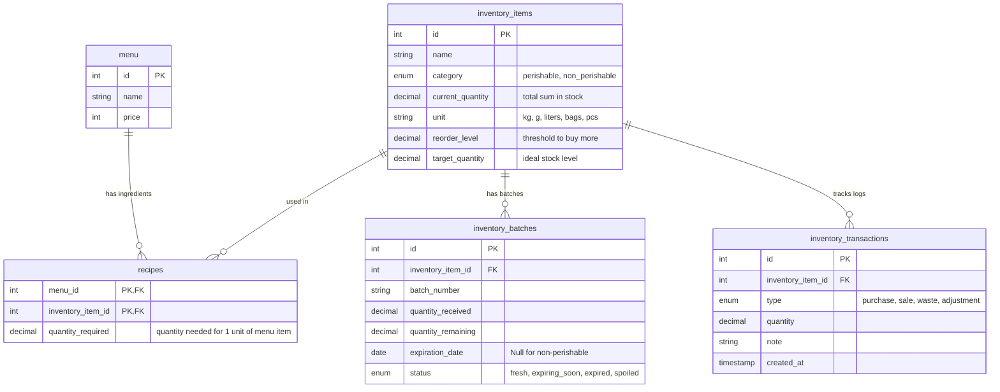

# Food Stock & Inventory Control Guide

Managing raw food ingredients (like Rice, Meat, Potatoes, Beans, Tomatoes, and Onions) requires a different approach than tracking final menu items. Raw ingredients have different storage units (kg, grams, liters) and shelf-lives, and they are combined into final dishes using **recipes**.

This guide outlines how to design, control, and report on perishable and non-perishable stock in a restaurant/cafe application.

---

## 1. Database Architecture

To track raw ingredients, map them to menu items, and handle batches for perishables, we propose adding four new tables:



### Table Schema Definitions (SQL)

```sql
-- 1. Inventory Items Table
CREATE TABLE inventory_items (
    id INT AUTO_INCREMENT PRIMARY KEY,
    name VARCHAR(100) NOT NULL,
    category ENUM('perishable', 'non_perishable') NOT NULL,
    current_quantity DECIMAL(10,2) DEFAULT 0.00,
    unit VARCHAR(20) NOT NULL, -- e.g., 'kg', 'grams', 'liters', 'pieces'
    reorder_level DECIMAL(10,2) NOT NULL, -- Alert threshold
    target_quantity DECIMAL(10,2) NOT NULL, -- Desired stock level to restock to
    updated_at TIMESTAMP DEFAULT CURRENT_TIMESTAMP ON UPDATE CURRENT_TIMESTAMP
);

-- 2. Inventory Batches Table (Essential for Perishables)
CREATE TABLE inventory_batches (
    id INT AUTO_INCREMENT PRIMARY KEY,
    inventory_item_id INT NOT NULL,
    batch_number VARCHAR(50),
    quantity_received DECIMAL(10,2) NOT NULL,
    quantity_remaining DECIMAL(10,2) NOT NULL,
    received_date DATE NOT NULL,
    expiration_date DATE NULL, -- Can be null for non-perishables (e.g. Rice, Beans)
    status ENUM('fresh', 'expired', 'spoiled') DEFAULT 'fresh',
    FOREIGN KEY (inventory_item_id) REFERENCES inventory_items(id) ON DELETE CASCADE
);

-- 3. Recipes (Bill of Materials - BOM)
-- Connects Menu Items to Raw Ingredients
CREATE TABLE recipes (
    menu_id INT NOT NULL,
    inventory_item_id INT NOT NULL,
    quantity_required DECIMAL(10,3) NOT NULL, -- Quantity used per serving (e.g. 0.150 kg for 150g Rice)
    PRIMARY KEY (menu_id, inventory_item_id),
    FOREIGN KEY (menu_id) REFERENCES menu(id) ON DELETE CASCADE,
    FOREIGN KEY (inventory_item_id) REFERENCES inventory_items(id) ON DELETE CASCADE
);

-- 4. Inventory Transactions (For Auditing)
CREATE TABLE inventory_transactions (
    id INT AUTO_INCREMENT PRIMARY KEY,
    inventory_item_id INT NOT NULL,
    type ENUM('purchase', 'sale', 'waste', 'adjustment') NOT NULL,
    quantity DECIMAL(10,2) NOT NULL, -- Positive for addition, negative for deduction
    note VARCHAR(255),
    created_at TIMESTAMP DEFAULT CURRENT_TIMESTAMP,
    FOREIGN KEY (inventory_item_id) REFERENCES inventory_items(id) ON DELETE CASCADE
);
```

---

## 2. Managing Perishables vs. Non-Perishables

Perishables and non-perishables require different operational controls:

| Feature | Perishables (Meat, Tomatoes, Onions, Potatoes) | Non-Perishables (Rice, Beans, Flour, Cooking Oil) |
| :--- | :--- | :--- |
| **Tracking Method** | **Batch Tracking (FIFO - First In, First Out)**. Always consume the oldest batch first. | **Aggregated Stock Level**. Simple count subtraction. |
| **Crucial Metric** | **Expiration Date**. Must alert when batches are within 2–3 days of expiring. | **Reorder Point**. Restock when quantity drops below safety levels. |
| **Shrinkage Control** | Track **Spoilage / Waste** via transactions to account for rotted tomatoes/onions or bad meat. | Track **Storage Loss** (pest damage or moisture). |
| **Reorder Speed** | High frequency, small batches to ensure freshness. | Low frequency, bulk purchases to save on costs. |

---

## 3. Inventory Reports

To produce reports of what is remaining and what needs to be purchased, use the following SQL queries.

### Report 1: Remaining Stock & Status Report
This report lists all ingredients, categories, quantities remaining, and status indicators.

```sql
SELECT 
    i.id,
    i.name,
    i.category,
    i.current_quantity,
    i.unit,
    i.reorder_level,
    CASE 
        WHEN i.current_quantity = 0 THEN 'Out of Stock'
        WHEN i.current_quantity <= i.reorder_level THEN 'Low Stock'
        ELSE 'In Stock'
    END AS stock_status,
    -- For perishables, get the quantity expiring within the next 3 days
    COALESCE(
        (SELECT SUM(quantity_remaining) 
         FROM inventory_batches 
         WHERE inventory_item_id = i.id 
           AND expiration_date IS NOT NULL 
           AND expiration_date <= DATE_ADD(CURDATE(), INTERVAL 3 DAY)
           AND quantity_remaining > 0
        ), 0
    ) AS quantity_expiring_soon,
    -- Count of expired batches
    COALESCE(
        (SELECT SUM(quantity_remaining) 
         FROM inventory_batches 
         WHERE inventory_item_id = i.id 
           AND expiration_date < CURDATE()
           AND quantity_remaining > 0
        ), 0
    ) AS quantity_expired
FROM inventory_items i;
```

#### Example Output:
| Name | Category | Current Qty | Unit | Status | Expiring Soon | Expired |
| :--- | :--- | :--- | :--- | :--- | :--- | :--- |
| **Meat** | Perishable | 12.50 | kg | In Stock | 4.00 kg | 0.00 kg |
| **Tomatoes** | Perishable | 1.20 | kg | Low Stock | 1.20 kg | 0.50 kg |
| **Rice** | Non-Perishable| 120.00 | kg | In Stock | 0.00 kg | 0.00 kg |
| **Onions** | Perishable | 0.00 | kg | Out of Stock| 0.00 kg | 0.00 kg |

---

### Report 2: Smart Purchase & Shopping List Report
This report identifies items that need restocking and calculates exactly how much to buy to bring inventory back to the `target_quantity`.

```sql
SELECT 
    name,
    category,
    current_quantity AS in_stock,
    reorder_level,
    target_quantity,
    (target_quantity - current_quantity) AS purchase_quantity,
    unit,
    -- Highlight urgent purchases
    CASE 
        WHEN current_quantity = 0 THEN 'CRITICAL (Out of Stock)'
        WHEN current_quantity <= reorder_level THEN 'URGENT (Below Threshold)'
        ELSE 'Optional'
    END AS priority
FROM inventory_items
WHERE current_quantity <= reorder_level
ORDER BY priority DESC, name ASC;
```

#### Example Output:
| Name | Category | In Stock | Reorder Level | Target Level | Order Qty | Unit | Priority |
| :--- | :--- | :--- | :--- | :--- | :--- | :--- | :--- |
| **Onions** | Perishable | 0.00 | 5.00 | 25.00 | **25.00** | kg | CRITICAL |
| **Tomatoes** | Perishable | 1.20 | 4.00 | 15.00 | **13.80** | kg | URGENT |
| **Beans** | Non-Perishable| 8.00 | 10.00 | 50.00 | **42.00** | kg | URGENT |

---

## 4. Integration Logic into Cafe Delivery System

To connect this logic with your checkout flow, you should deduct raw ingredients whenever a menu item is purchased.

### Step 1: Ingredient Deduction Logic during Checkout
When a checkout is processed, query the recipes for each ordered item and deduct the stock.

```php
// Inside api/checkout.php, during database transaction:

foreach ($cartItems as $item) {
    // 1. Fetch ingredients needed for this menu item
    $stmt = $pdo->prepare("
        SELECT r.inventory_item_id, r.quantity_required, i.name, i.current_quantity, i.unit 
        FROM recipes r
        JOIN inventory_items i ON r.inventory_item_id = i.id
        WHERE r.menu_id = :menu_id
    ");
    $stmt->execute([':menu_id' => $item['menu_id']]);
    $ingredients = $stmt->fetchAll();

    foreach ($ingredients as $ingredient) {
        $totalNeeded = $ingredient['quantity_required'] * $item['quantity'];

        // 2. Check if we have enough raw ingredients
        if ($ingredient['current_quantity'] < $totalNeeded) {
            throw new Exception("Sorry, we cannot prepare " . $item['name'] . ". Out of ingredient: " . $ingredient['name']);
        }

        // 3. Deduct total quantity from main inventory
        $updateInv = $pdo->prepare("
            UPDATE inventory_items 
            SET current_quantity = current_quantity - :deduct 
            WHERE id = :id
        ");
        $updateInv->execute([
            ':deduct' => $totalNeeded,
            ':id' => $ingredient['inventory_item_id']
        ]);

        // 4. Record Transaction Log
        $logStmt = $pdo->prepare("
            INSERT INTO inventory_transactions (inventory_item_id, type, quantity, note) 
            VALUES (:inv_id, 'sale', :qty, :note)
        ");
        $logStmt->execute([
            ':inv_id' => $ingredient['inventory_item_id'],
            ':qty' => -$totalNeeded,
            ':note' => "Order #$orderId - " . $item['name']
        ]);

        // 5. FIFO Batch deduction (For perishables)
        // Consume quantities from batches starting with the oldest expiration date
        $batchStmt = $pdo->prepare("
            SELECT id, quantity_remaining 
            FROM inventory_batches 
            WHERE inventory_item_id = :inv_id AND quantity_remaining > 0
            ORDER BY expiration_date ASC, received_date ASC
        ");
        $batchStmt->execute([':inv_id' => $ingredient['inventory_item_id']]);
        $batches = $batchStmt->fetchAll();

        $remainingToDeduct = $totalNeeded;
        foreach ($batches as $batch) {
            if ($remainingToDeduct <= 0) break;

            if ($batch['quantity_remaining'] >= $remainingToDeduct) {
                // This batch has enough to cover the rest of the deduction
                $deductBatch = $pdo->prepare("
                    UPDATE inventory_batches 
                    SET quantity_remaining = quantity_remaining - :qty 
                    WHERE id = :id
                ");
                $deductBatch->execute([':qty' => $remainingToDeduct, ':id' => $batch['id']]);
                $remainingToDeduct = 0;
            } else {
                // Empty this batch and move to the next
                $remainingToDeduct -= $batch['quantity_remaining'];
                $emptyBatch = $pdo->prepare("
                    UPDATE inventory_batches 
                    SET quantity_remaining = 0 
                    WHERE id = :id
                ");
                $emptyBatch->execute([':id' => $batch['id']]);
            }
        }
    }
}
```

### Step 2: Spoilage / Expiration Marking
Run a daily script (cron job) or trigger a check when the admin loads the dashboard to flag expired perishable stock:

```sql
-- Update status of batches that have passed their expiration date
UPDATE inventory_batches 
SET status = 'expired' 
WHERE expiration_date < CURDATE() AND quantity_remaining > 0;
```

---

## 5. Next Steps / Actions

If you want to implement this in your current Cafe Delivery app, we can follow these steps:
1. **Database Update**: Create a new DB update file (e.g. `db_update_inventory.php`) to create these tables.
2. **Admin panel API**: Create `api/inventory.php` to handle CRUD actions for ingredients, recipes, and batch updates.
3. **Dashboard Page**: Build a tab or page in the Admin Dashboard (`admin.php`) where you can:
   - View stock status & batch warnings.
   - Set up recipes for each menu item.
   - View/print the Restock / Purchase report.
